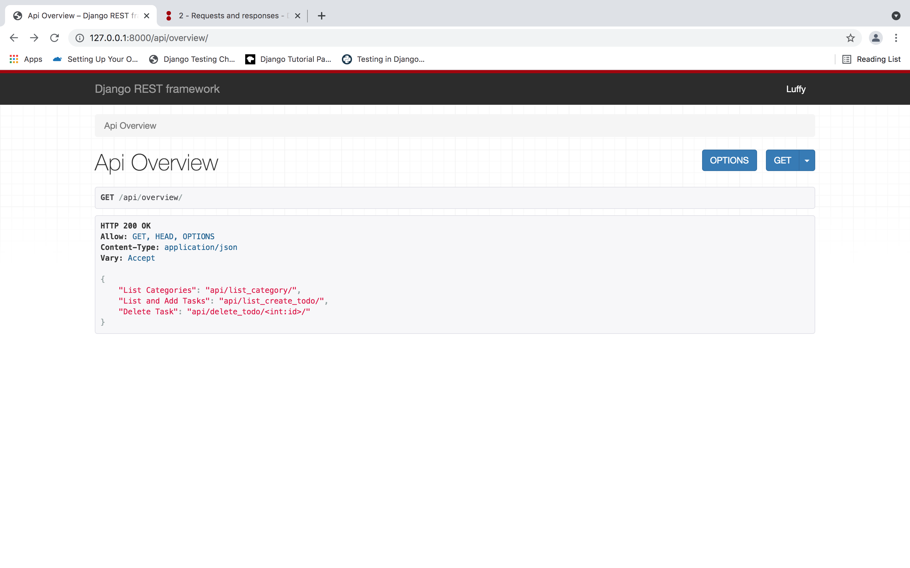
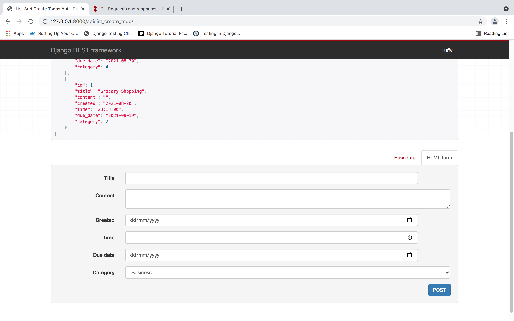
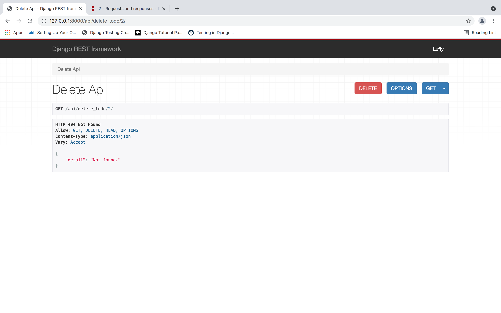

# TODO LIST REST API

A simple todo list rest api built with django rest framework

Detailed steps on how to make use of this api

1. Clone the repo
2. Create an environment
3. Make migrations
4. Runserver

And you are good to go :slightly_smiling_face:.

Goodluck consuming the api

Here are some screenshots of the API pages:
 

Overview :  

List and Create Tasks page:  

Delete Tasks page:  
